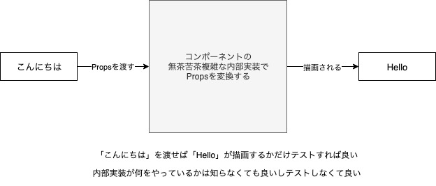

# React Testing Library

React コンポーネントをテストするためのユーティリティ関数を提供するライブラリ。

[DOM Testing Library](https://testing-library.com/docs/dom-testing-library/intro) というライブラリをラップしたライブラリなので、DOM Testing Library の API を利用できる。

似たようなライブラリとして Enzyme というライブラリが存在する。

この React Testing Library は公式ドキュメントでも紹介されている。

https://ja.reactjs.org/docs/testing.html#tools

## 基本理念

React Testing Library は「テストがソフトウェアの使用方法に似ているほど、信頼性が高まる」という基本理念（思想）を元に設計されている。

そのため、React Testing Library はユーザーの操作（振る舞い）を再現するテストを作成できるメソッドとユーティリティを提供している。

ライブラリが提供するユーティリティを利用することで、ユーザが行う方法と同じような方法で DOM を検索できる。

ユーザはラベルテキストからフォーム要素を見つけるが、React Testing Library もラベルテキストからフォーム要素を検索できる。

また、ユーザーはテキストからリンクやボタンを見つけるが、React Testing Library もテキストからリンクやボタンを検索できる。

## React Testing Library の特徴

- 実装の詳細を一切使用せずにテストできる（実装の詳細を変更しても影響を受けない）
- コンポーネントのインスタンスを取得、利用するのではなく、DOM ノードを取得や処理するクエリが提供されている（サンプルコードで解説）

### 実装の詳細とは

以下のようなものが実装の詳細。

- コンポーネントの内部状態
- コンポーネントの内部メソッド
- コンポーネントのライフサイクルメソッド
- 子コンポーネント

コンポーネントのテストの考え方は通常の関数のテストと同じで、入力に対して出力（描画、イベントの発火、メソッドが動作したかなど）が正しいかどうかをテストすれば良い。

そのため、上記のような実装の詳細を知る必要がない。

また、コンポーネントに無茶苦茶複雑な内部実装があったとしてもそれをテストする必要はない。

イメージとして以下のような感じ。



## Jest との併用

React Testing Library はあくまで、React コンポーネントのテストをしやすくするためのライブラリである。

そのため、Jest のようなテスティングフレームワークの代替にはならず、Jest と併用して利用することになる。

## インストール

```
$ npm install --save-dev @testing-library/react
```

カスタムマッチャーを利用したい場合は`@testing-library/jest-dom`もインストールする。

```
$ npm install --save-dev @testing-library/jest-dom
```

## Enzyme との違い

コンポーネントをレンダリングし、h1 値が正しいかどうかを確認するテスト。

### Enzyme

```js
test('has correct welcome text', () => {
  const wrapper = shallow(<Welcome firstName="John" lastName="Doe" />);
  expect(wrapper.find('h1').text()).to.equal('Welcome, John Doe');
});
```

### React Testing Library

```js
test('has correct welcome text', () => {
  render(<Welcome firstName="John" lastName="Doe" />);
  expect(screen.getByRole('heading')).toHaveTextContent('Welcome, John Doe');
});
```

## 使い方
